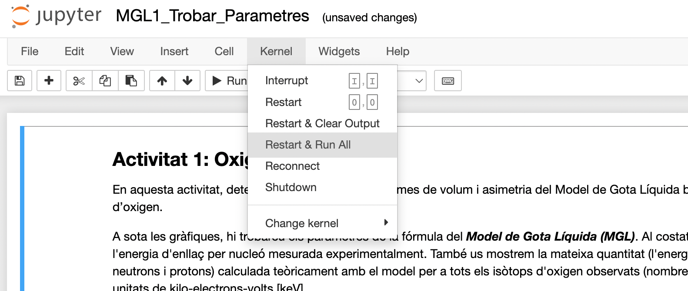

# Activitats Online: Model de Gota Líquida
Activitat de divulgació del grup de Física Nuclear, Atòmica i Molecular de la Universitat de Barcelona, desenvolupada a l'Institut de Ciències del Cosmos. Les activitats han estat dissenyades per la col.laboració [Binding Blocks](https://sites.google.com/york.ac.uk/bindingblocks/home), amb el Dr. Arnau Rios Huguet. La primera versió en Python ha estat desenvolupada per David Pascual Solís en el marc d'unes Pràctiques d'Empresa.

Pel context teòric necessari per desenvolupar les activitats podeu consultar l'arxiu adjunt a les activitats anomenat "Instruccions_Divulgacio_Nuclear.pdf" i/o el video https://youtu.be/W6IBa97V3nE.

Enllaç al Binder de l'Activitat 1 - Model de Gota Líquida Troba els Paràmetres:

Enllaç al Binder de l'Activitat 2 - Model de Gota Líquida Prediccions del Model:

Enllaç al Binder de l'Activitat 3 - Massa Mínima d'una Estrella de Neutrons:

Enllaç al Binder de l'Activitat 4 - Massa Màxima d'una Estrella de Neutrons:

Un cop carregat el Binder, aconsellem executar en la pestanya "Kernel" un "Restart & Run all", tal com es mostra a la imatge següent, per desenvolupar l'activitat de la forma que ha estat concebuda.

En acabar les activitats, us demanarem que respongueu algunes qüestions en el següent formulari:

https://forms.office.com/r/rDDD2RRTik

Per accedir a les activitats desenvolupades, podeu clicar els enllaços de Binder següents i seguir les indicacions al final d'aquest arxiu. El Binder executa remotament els programes, no implica recursos de la teva màquina ni requereix que tinguis cap entorn de Python preparat. Això sí, la primera vegada que executis una instància pot trigar una mica en carregar!

